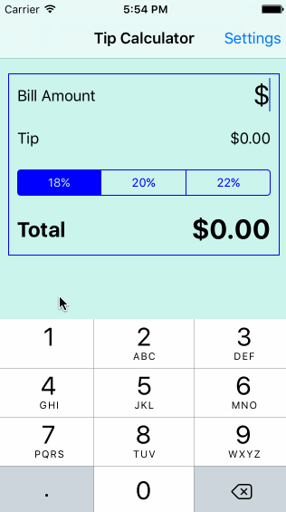

# gd-tip-calculator
tip calculator for code path

This is a Tip Calculator application for iOS submitted as the [pre-assignment](https://gist.github.com/timothy1ee/7747214) requirement for CodePath.

Time spent: ~7

Completed:

* [x] Required: User can enter a bill amount, choose a tip percentage, and see the tip and total values.
* [x] Required: Settings page to change the default tip percentage.
* [ ] Optional: UI animations
* [x] Optional: Remembering the bill amount across app restarts (if <10mins)
* [x] Optional: Using locale-specific currency and currency thousands separators.
* [x] Optional: Making sure the keyboard is always visible and the bill amount is always the first responder. This way the user doesn't have to tap anywhere to use this app. Just launch the app and start typing.
* [x] Optional: Add different color themes

Installation Instructions
- Built using Xcode 7.1 beta 2 (https://developer.apple.com/services-account/download?path=/Developer_Tools/Xcode_7.1_beta_2/Xcode_7.1_beta_2.dmg).
- Once you have xcode beta. git clone git@github.com:gdomingu/gd-tip-calculator.git
- Open in Xcode and press play

Note: There is a bug where the app crashes if you close it in simulator and try to open it again while Hardware -> Keyboard -> Connect Hardware Keyboard is off. To get around this switch to Connect Hardware Keyboard and rerun.
